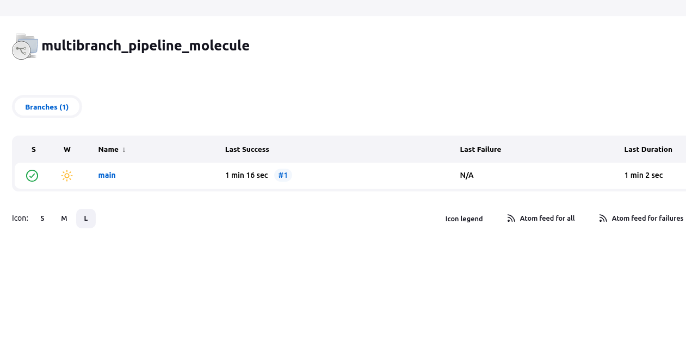

# Ответы к домашнему заданию по занятию 10 «Jenkins»

## Основная часть

1. Сделать Freestyle Job, который будет запускать `molecule test` из любого вашего репозитория с ролью.
```
PATH=$PATH:/home/jenkins/.local/bin
ansible-galaxy install -r requirements.yml
molecule test
ansible-galaxy role remove vector-role
```
2. Сделать Declarative Pipeline Job, который будет запускать `molecule test` из любого вашего репозитория с ролью.
```
pipeline {
    agent any
    stages {
                stage('Install requirements') {
            steps {
                sh 'PATH=$PATH:/home/jenkins/.local/bin ansible-galaxy install -r requirements.yml'
            }
        }
        stage('Run molecule') {
            steps {
                sh 'PATH=$PATH:/home/jenkins/.local/bin molecule test'
            }
        }
        stage('Clean role') {
            steps {
                sh 'PATH=$PATH:/home/jenkins/.local/bin ansible-galaxy role remove vector-role'
            }
        }
    }
}
```
3. Перенести Declarative Pipeline в репозиторий в файл `Jenkinsfile`.

[Jenkinsfile](https://github.com/fedor-metsger/vector-role/blob/main/Jenkinsfile)

4. Создать Multibranch Pipeline на запуск `Jenkinsfile` из репозитория.



5. Создать Scripted Pipeline, наполнить его скриптом из [pipeline](./pipeline).
6. Внести необходимые изменения, чтобы Pipeline запускал `ansible-playbook` без флагов `--check --diff`, если не установлен параметр при запуске джобы (prod_run = True). По умолчанию параметр имеет значение False и запускает прогон с флагами `--check --diff`.
```

``` 
7. Проверить работоспособность, исправить ошибки, исправленный Pipeline вложить в репозиторий в файл `ScriptedJenkinsfile`.
8. Отправить ссылку на репозиторий с ролью и Declarative Pipeline и Scripted Pipeline.

[Declarative Pipeline](https://github.com/fedor-metsger/vector-role/blob/main/Jenkinsfile)

[Scripted Pipeline](https://github.com/fedor-metsger/vector-role/blob/main/ScriptedJenkinsfile)


