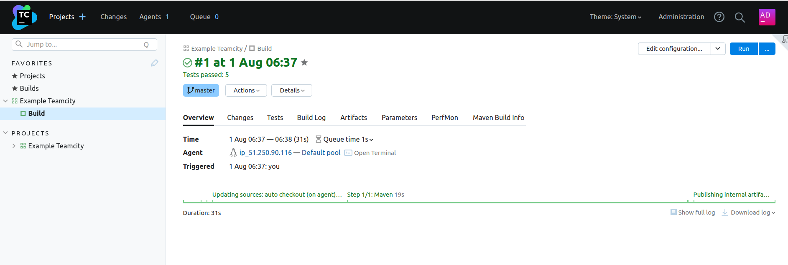
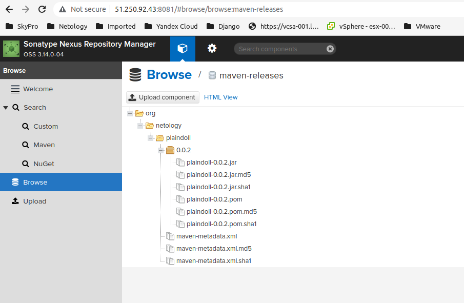
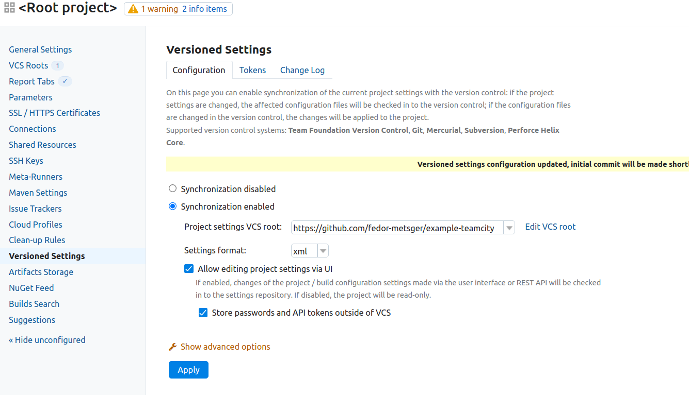
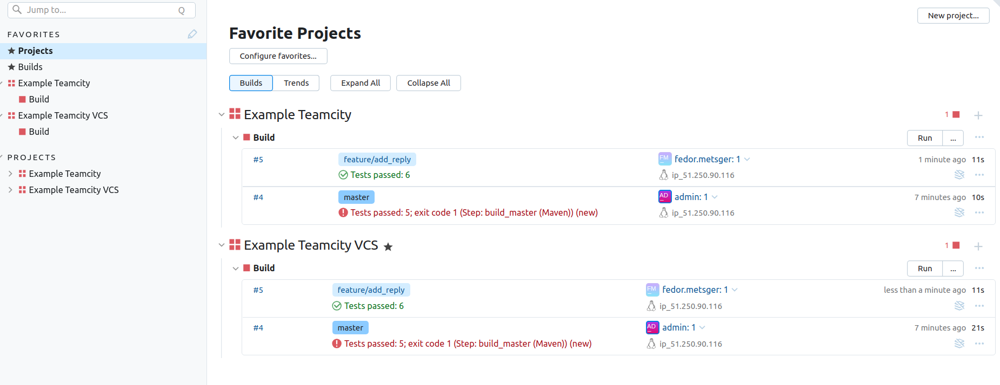
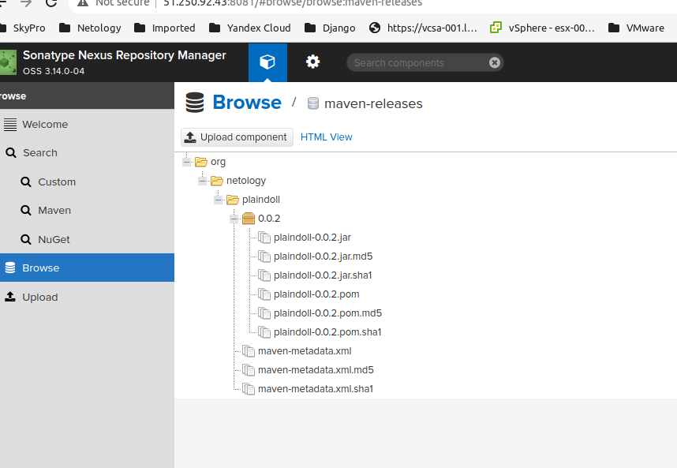
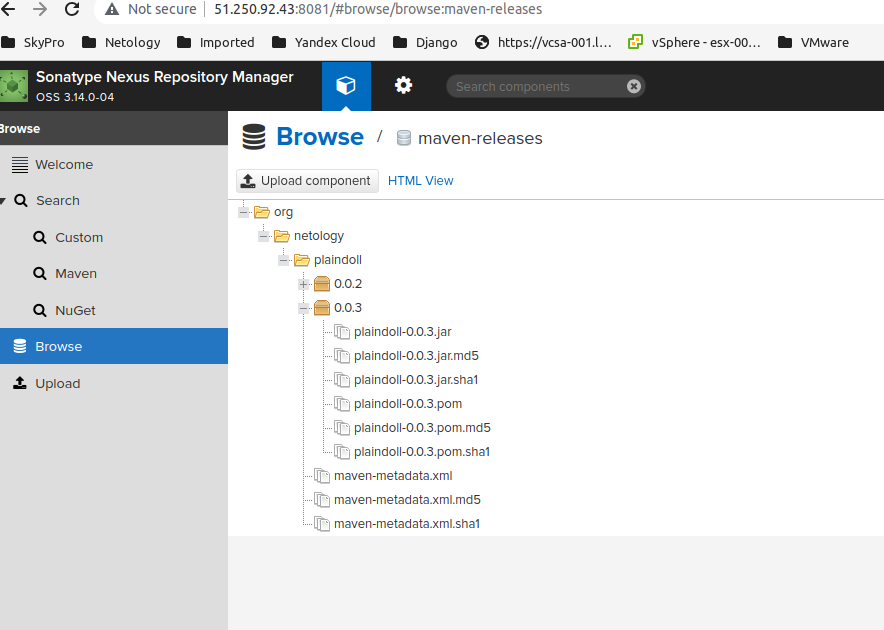

# Ответы по домашнему заданию к занятию 11 «Teamcity»

## Основная часть

1. Создайте новый проект в teamcity на основе fork.
 
   Форкнутый репозиторий: [example-teamcity](https://github.com/fedor-metsger/example-teamcity)

2. Сделайте autodetect конфигурации. 
3. Сохраните необходимые шаги, запустите первую сборку master.

   

4. Поменяйте условия сборки: если сборка по ветке `master`, то должен происходит `mvn clean deploy`, иначе `mvn clean test`.
5. Для deploy будет необходимо загрузить [settings.xml](./teamcity/settings.xml) в набор конфигураций maven у teamcity, предварительно записав туда креды для подключения к nexus.
6. В pom.xml необходимо поменять ссылки на репозиторий и nexus.

   Файл [pom.xml](https://github.com/fedor-metsger/example-teamcity/blob/master/pom.xml)
   
7. Запустите сборку по master, убедитесь, что всё прошло успешно и артефакт появился в nexus.

   

8. Мигрируйте `build configuration` в репозиторий.
   
   
   
9. Создайте отдельную ветку `feature/add_reply` в репозитории.

   Ветка: [feature/add_reply](https://github.com/fedor-metsger/example-teamcity/tree/feature/add_reply)
    
10. Напишите новый метод для класса Welcomer: метод должен возвращать произвольную реплику, содержащую слово `hunter`.

    Новый метод: [askHunter](https://github.com/fedor-metsger/example-teamcity/blob/5c73212918168e70c9d4c3cbc0d305d1fbbd07a2/src/main/java/plaindoll/Welcomer.java#L16)
  
11. Дополните тест для нового метода на поиск слова `hunter` в новой реплике.

    Новый тест: [welcomerAskHunter](https://github.com/fedor-metsger/example-teamcity/blob/5c73212918168e70c9d4c3cbc0d305d1fbbd07a2/src/test/java/plaindoll/WelcomerTest.java#L34)

12. Сделайте push всех изменений в новую ветку репозитория.
13. Убедитесь, что сборка самостоятельно запустилась, тесты прошли успешно.

14. Внесите изменения из произвольной ветки `feature/add_reply` в `master` через `Merge`.

    Pull request: [Add askHunter method](https://github.com/fedor-metsger/example-teamcity/pull/1)

15. Убедитесь, что нет собранного артефакта в сборке по ветке `master`.

16. Настройте конфигурацию так, чтобы она собирала `.jar` в артефакты сборки.
17. Проведите повторную сборку мастера, убедитесь, что сбора прошла успешно и артефакты собраны.

18. Проверьте, что конфигурация в репозитории содержит все настройки конфигурации из teamcity.

    Конфигурация сборки: [ExampleTeamcity_2_Build.xml](https://github.com/fedor-metsger/example-teamcity/blob/master/.teamcity/ExampleTeamcity_2/buildTypes/ExampleTeamcity_2_Build.xml)
    
19. В ответе пришлите ссылку на репозиторий.

    Репозиторий: [example-teamcity](https://github.com/fedor-metsger/example-teamcity)

