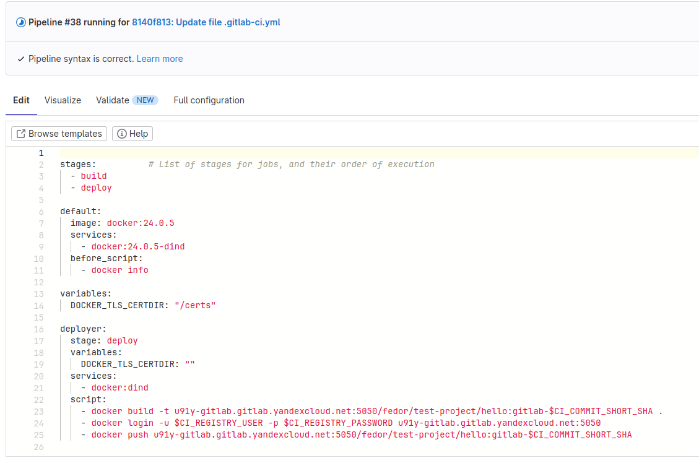
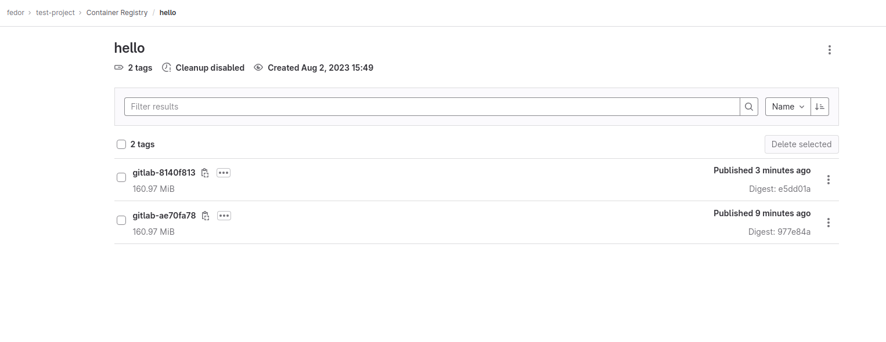

# Ответы к домашнему заданию по занятию 12 «GitLab»

## Основная часть

### DevOps

В репозитории содержится код проекта на Python. Проект — RESTful API сервис. Ваша задача — автоматизировать сборку образа с выполнением python-скрипта:

1. Образ собирается на основе [centos:7](https://hub.docker.com/_/centos?tab=tags&page=1&ordering=last_updated).
2. Python версии не ниже 3.7.
3. Установлены зависимости: `flask` `flask-jsonpify` `flask-restful`.

Файл `requirements.txt`:
```
flask
flask_restful
flask_jsonpify
```
5. Создана директория `/python_api`.
6. Скрипт из репозитория размещён в /python_api.
7. Точка вызова: запуск скрипта.

Файл `Dockerfile`:
```
FROM centos:7

RUN yum install python3=3.10 python3-pip -y
COPY requirements.txt requirements.txt
RUN pip3 install -r requirements.txt
RUN mkdir /python_api
COPY python-api.py /python_api/python-api.py
CMD ["python3", "/python_api/python-api.py"]``
```
8. При комите в любую ветку должен собираться docker image с форматом имени hello:gitlab-$CI_COMMIT_SHORT_SHA . Образ должен быть выложен в Gitlab registry или yandex registry.

Файл `.gitlab-ci.yml`
```
stages:          # List of stages for jobs, and their order of execution
  - build
  - deploy

default:
  image: docker:24.0.5
  services:
    - docker:24.0.5-dind
  before_script:
    - docker info

variables:
  DOCKER_TLS_CERTDIR: "/certs"

deployer:
  stage: deploy
  variables:
    DOCKER_TLS_CERTDIR: ""
  services:
    - docker:dind 
  script:
    - docker build -t u91y-gitlab.gitlab.yandexcloud.net:5050/fedor/test-project/hello:gitlab-$CI_COMMIT_SHORT_SHA .
    - docker login -u $CI_REGISTRY_USER -p $CI_REGISTRY_PASSWORD u91y-gitlab.gitlab.yandexcloud.net:5050
    - docker push u91y-gitlab.gitlab.yandexcloud.net:5050/fedor/test-project/hello:gitlab-$CI_COMMIT_SHORT_SHA
```
Конфигурация Pipeline:


Отработавший **pipeline**:


Результат загрузки в **registry**:


### Product Owner

Вашему проекту нужна бизнесовая доработка: нужно поменять JSON ответа на вызов метода GET `/rest/api/get_info`, необходимо создать Issue в котором указать:

1. Какой метод необходимо исправить.
2. Текст с `{ "message": "Already started" }` на `{ "message": "Running"}`.
3. Issue поставить label: feature.

### Developer

Пришёл новый Issue на доработку, вам нужно:

1. Создать отдельную ветку, связанную с этим Issue.
2. Внести изменения по тексту из задания.
3. Подготовить Merge Request, влить необходимые изменения в `master`, проверить, что сборка прошла успешно.


### Tester

Разработчики выполнили новый Issue, необходимо проверить валидность изменений:

1. Поднять докер-контейнер с образом `python-api:latest` и проверить возврат метода на корректность.
2. Закрыть Issue с комментарием об успешности прохождения, указав желаемый результат и фактически достигнутый.

## Итог

В качестве ответа пришлите подробные скриншоты по каждому пункту задания:

- файл gitlab-ci.yml;
- Dockerfile; 
- лог успешного выполнения пайплайна;
- решённый Issue.

### Важно 
После выполнения задания выключите и удалите все задействованные ресурсы в Yandex Cloud.

## Необязательная часть

Автомазируйте работу тестировщика — пусть у вас будет отдельный конвейер, который автоматически поднимает контейнер в docker или k8s и выполняет проверку, например, при помощи curl. На основе вывода будет приниматься решение об успешности прохождения тестирования.

