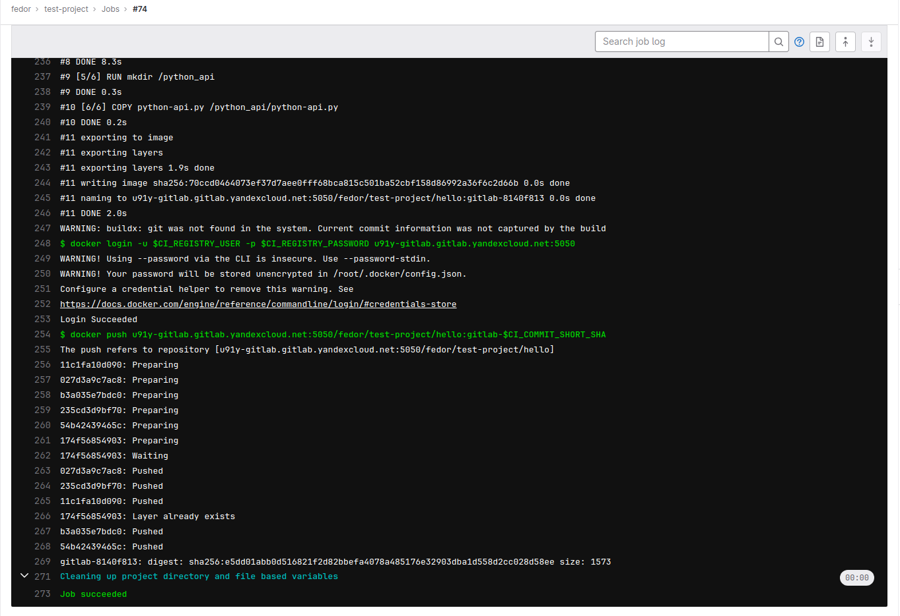

# Ответы к домашнему заданию по занятию 12 «GitLab»

## Основная часть

### DevOps

В репозитории содержится код проекта на Python. Проект — RESTful API сервис. Ваша задача — автоматизировать сборку образа с выполнением python-скрипта:

1. Образ собирается на основе [centos:7](https://hub.docker.com/_/centos?tab=tags&page=1&ordering=last_updated).
2. Python версии не ниже 3.7.
3. Установлены зависимости: `flask` `flask-jsonpify` `flask-restful`.

Файл `requirements.txt`:
```
flask
flask_restful
flask_jsonpify
```
5. Создана директория `/python_api`.
6. Скрипт из репозитория размещён в /python_api.
7. Точка вызова: запуск скрипта.

Файл `Dockerfile`:
```
FROM centos:7

RUN yum install python3=3.10 python3-pip -y
COPY requirements.txt requirements.txt
RUN pip3 install -r requirements.txt
RUN mkdir /python_api
COPY python-api.py /python_api/python-api.py
CMD ["python3", "/python_api/python-api.py"]``
```
8. При комите в любую ветку должен собираться docker image с форматом имени hello:gitlab-$CI_COMMIT_SHORT_SHA . Образ должен быть выложен в Gitlab registry или yandex registry.

Файл `.gitlab-ci.yml`
```
stages:          # List of stages for jobs, and their order of execution
  - build
  - deploy

default:
  image: docker:24.0.5
  services:
    - docker:24.0.5-dind
  before_script:
    - docker info

variables:
  DOCKER_TLS_CERTDIR: "/certs"

deployer:
  stage: deploy
  variables:
    DOCKER_TLS_CERTDIR: ""
  services:
    - docker:dind 
  script:
    - docker build -t u91y-gitlab.gitlab.yandexcloud.net:5050/fedor/test-project/hello:gitlab-$CI_COMMIT_SHORT_SHA .
    - docker login -u $CI_REGISTRY_USER -p $CI_REGISTRY_PASSWORD u91y-gitlab.gitlab.yandexcloud.net:5050
    - docker push u91y-gitlab.gitlab.yandexcloud.net:5050/fedor/test-project/hello:gitlab-$CI_COMMIT_SHORT_SHA
```
Конфигурация Pipeline:


Отработавший **pipeline**:


Результат загрузки в **registry**:


### Product Owner

Вашему проекту нужна бизнесовая доработка: нужно поменять JSON ответа на вызов метода GET `/rest/api/get_info`, необходимо создать Issue в котором указать:

1. Какой метод необходимо исправить.
2. Текст с `{ "message": "Already started" }` на `{ "message": "Running"}`.
3. Issue поставить label: feature.

Созданный **issue**:


### Developer

Пришёл новый Issue на доработку, вам нужно:

1. Создать отдельную ветку, связанную с этим Issue.
2. Внести изменения по тексту из задания.

4. Подготовить Merge Request, влить необходимые изменения в `master`, проверить, что сборка прошла успешно.

Созданный **merge request**:


Выполненный **merge request**:


**Issue** с активностью:


### Tester

Разработчики выполнили новый Issue, необходимо проверить валидность изменений:

1. Поднять докер-контейнер с образом `python-api:latest` и проверить возврат метода на корректность.
```
fedor@gitlab-runner:~$ docker run -d u91y-gitlab.gitlab.yandexcloud.net:5050/fedor/test-project/hello:gitlab-871480ba
cc8fedc341414db0de739d2838e84be8037c0dd4ec4dada3c292c6c03dff0dfe
fedor@gitlab-runner:~$ docker ps
CONTAINER ID   IMAGE                                                                              COMMAND                  CREATED          STATUS          PORTS     NAMES
cc8fedc34141   u91y-gitlab.gitlab.yandexcloud.net:5050/fedor/test-project/hello:gitlab-871480ba   "python3 /python_api…"   11 seconds ago   Up 10 seconds             reverent_agnesi
fedor@gitlab-runner:~$ wget http://172.17.0.2:5290/get_info -qO -
{"version": 3, "method": "GET", "message": "Running"}
fedor@gitlab-runner:~$
```
3. Закрыть Issue с комментарием об успешности прохождения, указав желаемый результат и фактически достигнутый.

Закрытый **issue**:


## Итог

В качестве ответа пришлите подробные скриншоты по каждому пункту задания:

- файл [.gitlab-ci.yml](https://github.com/fedor-metsger/gitlab_test_project/blob/main/.gitlab-ci.yml);
- [Dockerfile](https://github.com/fedor-metsger/gitlab_test_project/blob/main/Dockerfile); 
- лог успешного выполнения пайплайна:
```
Running with gitlab-runner 16.2.0 (782e15da)
  on Docker Runner 56cx_J-p, system ID: s_8eb96c890b3a
Preparing the "docker" executor
Using Docker executor with image docker:24.0.5 ...
Starting service docker:dind ...
Pulling docker image docker:dind ...
Using docker image sha256:0fddd6ec43ab484d35772852bbeefbc825bc2b9846d121f1e87da42cfef62e00 for docker:dind with digest docker@sha256:25a7feece7050334e8bd478dc9b6031c24db7fe81b2665abe690698ec52074f2 ...
Waiting for services to be up and running (timeout 30 seconds)...
Pulling docker image docker:24.0.5 ...
Using docker image sha256:0fddd6ec43ab484d35772852bbeefbc825bc2b9846d121f1e87da42cfef62e00 for docker:24.0.5 with digest docker@sha256:25a7feece7050334e8bd478dc9b6031c24db7fe81b2665abe690698ec52074f2 ...
Preparing environment
00:01
Running on runner-56cxj-p-project-1-concurrent-0 via gitlab-runner...
Getting source from Git repository
00:01
Fetching changes with git depth set to 20...
Reinitialized existing Git repository in /builds/fedor/test-project/.git/
Checking out 871480ba as detached HEAD (ref is main)...
Skipping Git submodules setup
Executing "step_script" stage of the job script
Using docker image sha256:0fddd6ec43ab484d35772852bbeefbc825bc2b9846d121f1e87da42cfef62e00 for docker:24.0.5 with digest docker@sha256:25a7feece7050334e8bd478dc9b6031c24db7fe81b2665abe690698ec52074f2 ...
$ docker info
WARNING: API is accessible on http://0.0.0.0:2375 without encryption.
         Access to the remote API is equivalent to root access on the host. Refer
         to the 'Docker daemon attack surface' section in the documentation for
         more information: https://docs.docker.com/go/attack-surface/
Client:
 Version:    24.0.5
 Context:    default
 Debug Mode: false
 Plugins:
  buildx: Docker Buildx (Docker Inc.)
    Version:  v0.11.2
    Path:     /usr/local/libexec/docker/cli-plugins/docker-buildx
  compose: Docker Compose (Docker Inc.)
    Version:  v2.20.2
    Path:     /usr/local/libexec/docker/cli-plugins/docker-compose
Server:
 Containers: 0
  Running: 0
  Paused: 0
  Stopped: 0
 Images: 0
 Server Version: 24.0.5
 Storage Driver: overlay2
  Backing Filesystem: extfs
  Supports d_type: true
  Using metacopy: false
  Native Overlay Diff: true
  userxattr: false
 Logging Driver: json-file
 Cgroup Driver: cgroupfs
 Cgroup Version: 2
 Plugins:
  Volume: local
  Network: bridge host ipvlan macvlan null overlay
  Log: awslogs fluentd gcplogs gelf journald json-file local logentries splunk syslog
 Swarm: inactive
 Runtimes: io.containerd.runc.v2 runc
 Default Runtime: runc
 Init Binary: docker-init
 containerd version: 1677a17964311325ed1c31e2c0a3589ce6d5c30d
 runc version: v1.1.8-0-g82f18fe
 init version: de40ad0
 Security Options:
  apparmor
  seccomp
   Profile: builtin
  cgroupns
 Kernel Version: 5.15.0-76-generic
 Operating System: Alpine Linux v3.18 (containerized)
 OSType: linux
 Architecture: x86_64
 CPUs: 2
 Total Memory: 7.751GiB
 Name: 3dc7d68411c3
 ID: f5a086b8-a0ae-4d21-9265-f8b8084fc779
 Docker Root Dir: /var/lib/docker
 Debug Mode: false
 Experimental: false
 Insecure Registries:
  127.0.0.0/8
 Live Restore Enabled: false
 Product License: Community Engine
$ docker build -t u91y-gitlab.gitlab.yandexcloud.net:5050/fedor/test-project/hello:gitlab-$CI_COMMIT_SHORT_SHA .
#0 building with "default" instance using docker driver
#1 [internal] load build definition from Dockerfile
#1 transferring dockerfile: 286B done
#1 DONE 0.1s
#2 [internal] load .dockerignore
#2 transferring context: 2B done
#2 DONE 0.1s
#3 [internal] load metadata for docker.io/library/centos:7
#3 DONE 1.8s
#4 [internal] load build context
#4 transferring context: 509B done
#4 DONE 0.0s
#5 [1/6] FROM docker.io/library/centos:7@sha256:be65f488b7764ad3638f236b7b515b3678369a5124c47b8d32916d6487418ea4
#5 resolve docker.io/library/centos:7@sha256:be65f488b7764ad3638f236b7b515b3678369a5124c47b8d32916d6487418ea4 0.0s done
#5 sha256:eeb6ee3f44bd0b5103bb561b4c16bcb82328cfe5809ab675bb17ab3a16c517c9 2.75kB / 2.75kB done
#5 sha256:2d473b07cdd5f0912cd6f1a703352c82b512407db6b05b43f2553732b55df3bc 0B / 76.10MB 0.1s
#5 sha256:be65f488b7764ad3638f236b7b515b3678369a5124c47b8d32916d6487418ea4 1.20kB / 1.20kB done
#5 sha256:dead07b4d8ed7e29e98de0f4504d87e8880d4347859d839686a31da35a3b532f 529B / 529B done
#5 sha256:2d473b07cdd5f0912cd6f1a703352c82b512407db6b05b43f2553732b55df3bc 24.12MB / 76.10MB 0.4s
#5 sha256:2d473b07cdd5f0912cd6f1a703352c82b512407db6b05b43f2553732b55df3bc 38.80MB / 76.10MB 0.5s
#5 sha256:2d473b07cdd5f0912cd6f1a703352c82b512407db6b05b43f2553732b55df3bc 53.48MB / 76.10MB 0.6s
#5 sha256:2d473b07cdd5f0912cd6f1a703352c82b512407db6b05b43f2553732b55df3bc 73.40MB / 76.10MB 0.8s
#5 extracting sha256:2d473b07cdd5f0912cd6f1a703352c82b512407db6b05b43f2553732b55df3bc
#5 sha256:2d473b07cdd5f0912cd6f1a703352c82b512407db6b05b43f2553732b55df3bc 76.10MB / 76.10MB 1.6s done
#5 extracting sha256:2d473b07cdd5f0912cd6f1a703352c82b512407db6b05b43f2553732b55df3bc 2.7s done
#5 DONE 4.7s
#6 [2/6] RUN yum install python3=3.10 python3-pip -y
#6 0.388 Loaded plugins: fastestmirror, ovl
#6 0.647 Determining fastest mirrors
#6 0.972  * base: mirror.yandex.ru
#6 0.973  * extras: mirror.yandex.ru
#6 0.974  * updates: mirror.yandex.ru
#6 10.96 No package python3=3.10 available.
#6 11.24 Resolving Dependencies
#6 11.25 --> Running transaction check
#6 11.25 ---> Package python3-pip.noarch 0:9.0.3-8.el7 will be installed
#6 11.25 --> Processing Dependency: python(abi) = 3.6 for package: python3-pip-9.0.3-8.el7.noarch
#6 11.39 --> Processing Dependency: python3-setuptools for package: python3-pip-9.0.3-8.el7.noarch
#6 11.39 --> Processing Dependency: /usr/bin/python3 for package: python3-pip-9.0.3-8.el7.noarch
#6 11.39 --> Running transaction check
#6 11.39 ---> Package python3.x86_64 0:3.6.8-19.el7_9 will be installed
#6 11.40 --> Processing Dependency: python3-libs(x86-64) = 3.6.8-19.el7_9 for package: python3-3.6.8-19.el7_9.x86_64
#6 11.40 --> Processing Dependency: libpython3.6m.so.1.0()(64bit) for package: python3-3.6.8-19.el7_9.x86_64
#6 11.40 ---> Package python3-setuptools.noarch 0:39.2.0-10.el7 will be installed
#6 11.40 --> Running transaction check
#6 11.40 ---> Package python3-libs.x86_64 0:3.6.8-19.el7_9 will be installed
#6 11.41 --> Processing Dependency: libtirpc.so.1()(64bit) for package: python3-libs-3.6.8-19.el7_9.x86_64
#6 11.41 --> Running transaction check
#6 11.41 ---> Package libtirpc.x86_64 0:0.2.4-0.16.el7 will be installed
#6 11.49 --> Finished Dependency Resolution
#6 11.50 
#6 11.50 Dependencies Resolved
#6 11.50 
#6 11.50 ================================================================================
#6 11.50  Package                  Arch         Version              Repository     Size
#6 11.50 ================================================================================
#6 11.50 Installing:
#6 11.50  python3-pip              noarch       9.0.3-8.el7          base          1.6 M
#6 11.50 Installing for dependencies:
#6 11.50  libtirpc                 x86_64       0.2.4-0.16.el7       base           89 k
#6 11.50  python3                  x86_64       3.6.8-19.el7_9       updates        70 k
#6 11.50  python3-libs             x86_64       3.6.8-19.el7_9       updates       6.9 M
#6 11.50  python3-setuptools       noarch       39.2.0-10.el7        base          629 k
#6 11.50 
#6 11.50 Transaction Summary
#6 11.50 ================================================================================
#6 11.50 Install  1 Package (+4 Dependent packages)
#6 11.50 
#6 11.50 Total download size: 9.3 M
#6 11.50 Installed size: 48 M
#6 11.50 Downloading packages:
#6 11.60 warning: /var/cache/yum/x86_64/7/base/packages/libtirpc-0.2.4-0.16.el7.x86_64.rpm: Header V3 RSA/SHA256 Signature, key ID f4a80eb5: NOKEY
#6 11.60 Public key for libtirpc-0.2.4-0.16.el7.x86_64.rpm is not installed
#6 11.61 Public key for python3-3.6.8-19.el7_9.x86_64.rpm is not installed
#6 11.68 --------------------------------------------------------------------------------
#6 11.69 Total                                               51 MB/s | 9.3 MB  00:00     
#6 11.69 Retrieving key from file:///etc/pki/rpm-gpg/RPM-GPG-KEY-CentOS-7
#6 11.69 Importing GPG key 0xF4A80EB5:
#6 11.69  Userid     : "CentOS-7 Key (CentOS 7 Official Signing Key) <security@centos.org>"
#6 11.69  Fingerprint: 6341 ab27 53d7 8a78 a7c2 7bb1 24c6 a8a7 f4a8 0eb5
#6 11.69  Package    : centos-release-7-9.2009.0.el7.centos.x86_64 (@CentOS)
#6 11.69  From       : /etc/pki/rpm-gpg/RPM-GPG-KEY-CentOS-7
#6 11.71 Running transaction check
#6 11.73 Running transaction test
#6 11.76 Transaction test succeeded
#6 11.76 Running transaction
#6 11.84   Installing : libtirpc-0.2.4-0.16.el7.x86_64                               1/5 
#6 12.13   Installing : python3-setuptools-39.2.0-10.el7.noarch                      2/5 
#6 12.58   Installing : python3-pip-9.0.3-8.el7.noarch                               3/5 
#6 12.62   Installing : python3-3.6.8-19.el7_9.x86_64                                4/5 
#6 13.99   Installing : python3-libs-3.6.8-19.el7_9.x86_64                           5/5 
#6 14.04   Verifying  : libtirpc-0.2.4-0.16.el7.x86_64                               1/5 
#6 14.06   Verifying  : python3-libs-3.6.8-19.el7_9.x86_64                           2/5 
#6 14.09   Verifying  : python3-3.6.8-19.el7_9.x86_64                                3/5 
#6 14.14   Verifying  : python3-setuptools-39.2.0-10.el7.noarch                      4/5 
#6 14.22   Verifying  : python3-pip-9.0.3-8.el7.noarch                               5/5 
#6 14.43 
#6 14.43 Installed:
#6 14.43   python3-pip.noarch 0:9.0.3-8.el7                                              
#6 14.43 
#6 14.43 Dependency Installed:
#6 14.43   libtirpc.x86_64 0:0.2.4-0.16.el7                                              
#6 14.43   python3.x86_64 0:3.6.8-19.el7_9                                               
#6 14.43   python3-libs.x86_64 0:3.6.8-19.el7_9                                          
#6 14.43   python3-setuptools.noarch 0:39.2.0-10.el7                                     
#6 14.43 
#6 14.43 Complete!
#6 DONE 24.4s
#7 [3/6] COPY requirements.txt requirements.txt
#7 DONE 0.2s
#8 [4/6] RUN pip3 install -r requirements.txt
#8 0.575 WARNING: Running pip install with root privileges is generally not a good idea. Try `pip3 install --user` instead.
#8 0.619 Collecting flask (from -r requirements.txt (line 1))
#8 1.171   Downloading https://files.pythonhosted.org/packages/cd/77/59df23681f4fd19b7cbbb5e92484d46ad587554f5d490f33ef907e456132/Flask-2.0.3-py3-none-any.whl (95kB)
#8 1.291 Collecting flask_restful (from -r requirements.txt (line 2))
#8 1.461   Downloading https://files.pythonhosted.org/packages/d7/7b/f0b45f0df7d2978e5ae51804bb5939b7897b2ace24306009da0cc34d8d1f/Flask_RESTful-0.3.10-py2.py3-none-any.whl
#8 1.550 Collecting flask_jsonpify (from -r requirements.txt (line 3))
#8 1.713   Downloading https://files.pythonhosted.org/packages/60/0f/c389dea3988bffbe32c1a667989914b1cc0bce31b338c8da844d5e42b503/Flask-Jsonpify-1.5.0.tar.gz
#8 2.074 Collecting itsdangerous>=2.0 (from flask->-r requirements.txt (line 1))
#8 2.353   Downloading https://files.pythonhosted.org/packages/9c/96/26f935afba9cd6140216da5add223a0c465b99d0f112b68a4ca426441019/itsdangerous-2.0.1-py3-none-any.whl
#8 2.424 Collecting click>=7.1.2 (from flask->-r requirements.txt (line 1))
#8 2.611   Downloading https://files.pythonhosted.org/packages/4a/a8/0b2ced25639fb20cc1c9784de90a8c25f9504a7f18cd8b5397bd61696d7d/click-8.0.4-py3-none-any.whl (97kB)
#8 2.702 Collecting Jinja2>=3.0 (from flask->-r requirements.txt (line 1))
#8 3.017   Downloading https://files.pythonhosted.org/packages/20/9a/e5d9ec41927401e41aea8af6d16e78b5e612bca4699d417f646a9610a076/Jinja2-3.0.3-py3-none-any.whl (133kB)
#8 3.139 Collecting Werkzeug>=2.0 (from flask->-r requirements.txt (line 1))
#8 3.440   Downloading https://files.pythonhosted.org/packages/f4/f3/22afbdb20cc4654b10c98043414a14057cd27fdba9d4ae61cea596000ba2/Werkzeug-2.0.3-py3-none-any.whl (289kB)
#8 3.570 Collecting aniso8601>=0.82 (from flask_restful->-r requirements.txt (line 2))
#8 3.837   Downloading https://files.pythonhosted.org/packages/e3/04/e97c12dc034791d7b504860acfcdd2963fa21ae61eaca1c9d31245f812c3/aniso8601-9.0.1-py2.py3-none-any.whl (52kB)
#8 3.919 Collecting pytz (from flask_restful->-r requirements.txt (line 2))
#8 4.254   Downloading https://files.pythonhosted.org/packages/7f/99/ad6bd37e748257dd70d6f85d916cafe79c0b0f5e2e95b11f7fbc82bf3110/pytz-2023.3-py2.py3-none-any.whl (502kB)
#8 4.437 Collecting six>=1.3.0 (from flask_restful->-r requirements.txt (line 2))
#8 4.699   Downloading https://files.pythonhosted.org/packages/d9/5a/e7c31adbe875f2abbb91bd84cf2dc52d792b5a01506781dbcf25c91daf11/six-1.16.0-py2.py3-none-any.whl
#8 4.768 Collecting importlib-metadata; python_version < "3.8" (from click>=7.1.2->flask->-r requirements.txt (line 1))
#8 5.108   Downloading https://files.pythonhosted.org/packages/a0/a1/b153a0a4caf7a7e3f15c2cd56c7702e2cf3d89b1b359d1f1c5e59d68f4ce/importlib_metadata-4.8.3-py3-none-any.whl
#8 5.207 Collecting MarkupSafe>=2.0 (from Jinja2>=3.0->flask->-r requirements.txt (line 1))
#8 5.505   Downloading https://files.pythonhosted.org/packages/fc/d6/57f9a97e56447a1e340f8574836d3b636e2c14de304943836bd645fa9c7e/MarkupSafe-2.0.1-cp36-cp36m-manylinux1_x86_64.whl
#8 5.580 Collecting dataclasses; python_version < "3.7" (from Werkzeug>=2.0->flask->-r requirements.txt (line 1))
#8 5.740   Downloading https://files.pythonhosted.org/packages/fe/ca/75fac5856ab5cfa51bbbcefa250182e50441074fdc3f803f6e76451fab43/dataclasses-0.8-py3-none-any.whl
#8 5.810 Collecting typing-extensions>=3.6.4; python_version < "3.8" (from importlib-metadata; python_version < "3.8"->click>=7.1.2->flask->-r requirements.txt (line 1))
#8 6.068   Downloading https://files.pythonhosted.org/packages/45/6b/44f7f8f1e110027cf88956b59f2fad776cca7e1704396d043f89effd3a0e/typing_extensions-4.1.1-py3-none-any.whl
#8 6.138 Collecting zipp>=0.5 (from importlib-metadata; python_version < "3.8"->click>=7.1.2->flask->-r requirements.txt (line 1))
#8 6.426   Downloading https://files.pythonhosted.org/packages/bd/df/d4a4974a3e3957fd1c1fa3082366d7fff6e428ddb55f074bf64876f8e8ad/zipp-3.6.0-py3-none-any.whl
#8 6.494 Installing collected packages: itsdangerous, typing-extensions, zipp, importlib-metadata, click, MarkupSafe, Jinja2, dataclasses, Werkzeug, flask, aniso8601, pytz, six, flask-restful, flask-jsonpify
#8 7.157   Running setup.py install for flask-jsonpify: started
#8 7.436     Running setup.py install for flask-jsonpify: finished with status 'done'
#8 7.482 Successfully installed Jinja2-3.0.3 MarkupSafe-2.0.1 Werkzeug-2.0.3 aniso8601-9.0.1 click-8.0.4 dataclasses-0.8 flask-2.0.3 flask-jsonpify-1.5.0 flask-restful-0.3.10 importlib-metadata-4.8.3 itsdangerous-2.0.1 pytz-2023.3 six-1.16.0 typing-extensions-4.1.1 zipp-3.6.0
#8 DONE 8.1s
#9 [5/6] RUN mkdir /python_api
#9 DONE 0.4s
#10 [6/6] COPY python-api.py /python_api/python-api.py
#10 DONE 0.2s
#11 exporting to image
#11 exporting layers
#11 exporting layers 1.6s done
#11 writing image sha256:ba0b940a748b03d6ec377292313455b67a745b464c43d2cec340b3c6374e7f2d done
#11 naming to u91y-gitlab.gitlab.yandexcloud.net:5050/fedor/test-project/hello:gitlab-871480ba done
#11 DONE 1.6s
WARNING: buildx: git was not found in the system. Current commit information was not captured by the build
$ docker login -u $CI_REGISTRY_USER -p $CI_REGISTRY_PASSWORD u91y-gitlab.gitlab.yandexcloud.net:5050
WARNING! Using --password via the CLI is insecure. Use --password-stdin.
WARNING! Your password will be stored unencrypted in /root/.docker/config.json.
Configure a credential helper to remove this warning. See
https://docs.docker.com/engine/reference/commandline/login/#credentials-store
Login Succeeded
$ docker push u91y-gitlab.gitlab.yandexcloud.net:5050/fedor/test-project/hello:gitlab-$CI_COMMIT_SHORT_SHA
The push refers to repository [u91y-gitlab.gitlab.yandexcloud.net:5050/fedor/test-project/hello]
2ea90232c330: Preparing
12f2471963de: Preparing
01cb2c58631c: Preparing
235cd3d9bf70: Preparing
87e72fd45017: Preparing
174f56854903: Preparing
174f56854903: Waiting
235cd3d9bf70: Pushed
12f2471963de: Pushed
2ea90232c330: Pushed
01cb2c58631c: Pushed
174f56854903: Layer already exists
87e72fd45017: Pushed
gitlab-871480ba: digest: sha256:15b34f4623b9ca4de00e5e320c0c31cd5c6944a45486edae074c6824df5ef866 size: 1573
Cleaning up project directory and file based variables
00:01
Job succeeded
```
- решённый Issue.


