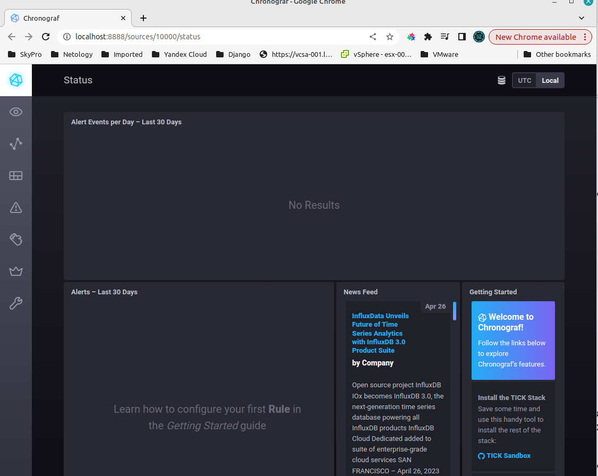
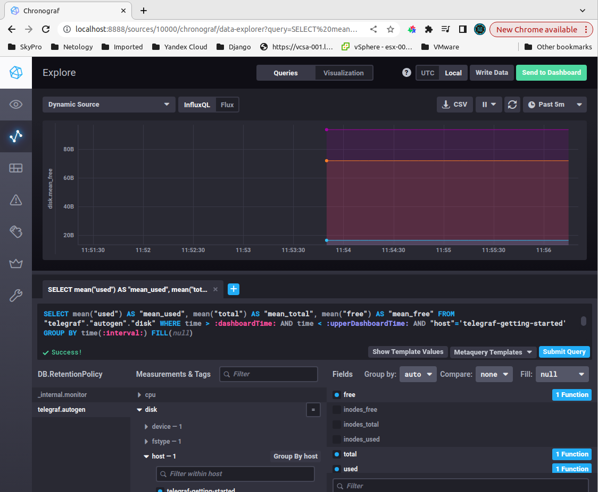
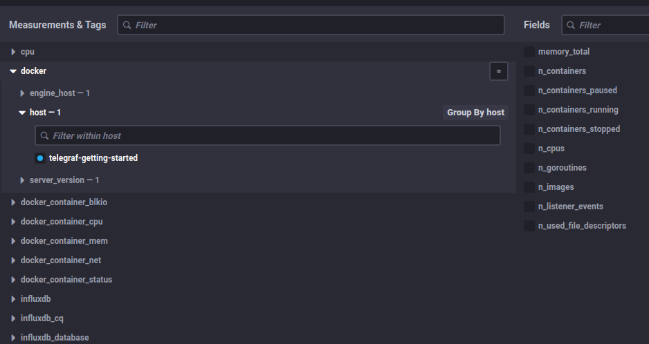

# Ответы к домашнему заданию по занятию "13.Системы мониторинга"

## Обязательные задания

### 1. Вас пригласили настроить мониторинг на проект. На онбординге вам рассказали, что проект представляет из себя 
платформу для вычислений с выдачей текстовых отчетов, которые сохраняются на диск. Взаимодействие с платформой 
осуществляется по протоколу http. Также вам отметили, что вычисления загружают ЦПУ. Какой минимальный набор метрик вы
выведите в мониторинг и почему?

   **Ответ:** Я бы добавил следующие метрики:
- общая загрузка CPU (**CPU LA**) (указано что при работе приложения идет загрузка CPU)
- колличество загруженной и свободной **RAM** (**RAM** /**swap**) (влияет на быстродействои выполнения операций)
- нагрузка на диск, число операций с диском (**IOPS**) (отчеты сохраняются на диск - необходимо контролировать состояние диска)
- соотношение занятого/свободного места на диске (**FS**) (отчеты сохраняются на диск - необходим видеть расход пространства)
- состояние занятых/свободных **inods** (отчеты сохраняются на диск - необходимо контролировать количество оставшихся **inodes**)
- общее количество http запросов к приложению (контроль нагрузки приложения)
- количество успешно/неуспешно выданных ответов (анализ работы платформы с точки зрения бизнеса, предоставление информации и контроль за простоем системы из-за проведения плановых и внеплановых ремонтных работ)

### 2. Менеджер продукта посмотрев на ваши метрики сказал, что ему непонятно что такое RAM/inodes/CPUla. Также он сказал, что хочет понимать, насколько мы выполняем свои обязанности перед клиентами и какое качество обслуживания. Что вы можете ему предложить?

   **Ответ:** Утвердить **SLA** (соглашение об уровне обслуживания) в рамках которого будут указаны **SLI** (показатель качества обслуживания) и **SLO** (целевой уровень качества обслуживания) для тех или иных метрик.  
   Это позволяет менеджеру не зная для чего та или иная метрика, но позволяет им понять общую картину сотояния работоспособности проекта.
   

### 3. Вашей DevOps команде в этом году не выделили финансирование на построение системы сбора логов. Разработчики в свою очередь хотят видеть все ошибки, которые выдают их приложения. Какое решение вы можете предпринять в этой ситуации, чтобы разработчики получали ошибки приложения?

   **Ответ:** Я бы написал свой скрипт на python, например.
   
### 4. Вы, как опытный SRE, сделали мониторинг, куда вывели отображения выполнения SLA=99% по http кодам ответов. Вычисляете этот параметр по следующей формуле: summ_2xx_requests/summ_all_requests. Данный параметр не поднимается выше 70%, но при этом в вашей системе нет кодов ответа 5xx и 4xx. Где у вас ошибка?

   **Ответ:** Тут не учитываются ошибки с кодами **1xx** и **3xx**. Я бы добавил детализацию по ним, для полноты картины.  
   Параметр для вычисления SLA я бы сделал в виде:  
   `(summ_2xx_requests + summ_1xx_requests + summ_3xx_requests)/summ_all_requests`
   
### 5. Опишите основные плюсы и минусы pull и push систем мониторинга.

   **Ответ:**  
   
   **Push** - плюсы:
- можно указать несколько точек отправки для репликации метрик
- более гибкая настройка отправки пакетов данных с метриками между агентами
- UDP — это менее затратный способ передачи данных, из-за чего может возрасти производительность сбора метрик

**Push** - минусы:

- менее централизованная настройка агентов
- при недоступности агента, невозможно понять причину.
  
**Pull** - плюсы:

- легче контролировать подлинность данных
- можно настроить единый proxy server до всех агентов с TLS для взаимодействия с сервером
- упрощённая отладка получения данных с агентов
  
**Pull** - минусы:

- **node_exporter** потребляет значительный ресурс на объекте мониторинга
- нужно беспокоиться о безопасности доступа к объекту мониторинга
   
### 6. Какие из ниже перечисленных систем относятся к push модели, а какие к pull? А может есть гибридные?
    - Prometheus 
    - TICK
    - Zabbix
    - VictoriaMetrics
    - Nagios

   **Ответ:**
   - **Prometheus** - в основном **pull** модель
   - **TICK** - **push** модель
   - **Zabbix** - **гибридная** модель
   - **VictoriaMetrics** - **гибридная** модель
   - **Nagios** - **push** модель
   
### 7. Склонируйте себе [репозиторий](https://github.com/influxdata/sandbox/tree/master) и запустите TICK-стэк, используя технологии docker и docker-compose. В виде решения на это упражнение приведите скриншот веб-интерфейса ПО chronograf ([http://localhost:8888](http://localhost:8888)). 
### P.S.: если при запуске некоторые контейнеры будут падать с ошибкой - проставьте им режим `Z`, например `./data:/var/lib:Z`

   **Ответ:**

   
### 8. Перейдите в веб-интерфейс Chronograf (`http://localhost:8888`) и откройте вкладку `Data explorer`.
    - Нажмите на кнопку `Add a query`
    - Изучите вывод интерфейса и выберите БД `telegraf.autogen`
    - В `measurments` выберите mem->host->telegraf_container_id , а в `fields` выберите used_percent. 
    Внизу появится график утилизации оперативной памяти в контейнере telegraf.
    - Вверху вы можете увидеть запрос, аналогичный SQL-синтаксису. 
    Поэкспериментируйте с запросом, попробуйте изменить группировку и интервал наблюдений.

### Для выполнения задания приведите скриншот с отображением метрик утилизации места на диске 
(disk->host->telegraf_container_id) из веб-интерфейса.

   **Ответ:**


### 9. Изучите список [telegraf inputs](https://github.com/influxdata/telegraf/tree/master/plugins/inputs). Добавьте в конфигурацию telegraf следующий плагин - [docker](https://github.com/influxdata/telegraf/tree/master/plugins/inputs/docker):
```
[[inputs.docker]]
  endpoint = "unix:///var/run/docker.sock"
```

### Дополнительно вам может потребоваться донастройка контейнера telegraf в `docker-compose.yml` дополнительного volume и режима privileged:
```
  telegraf:
    image: telegraf:1.4.0
    privileged: true
    volumes:
      - ./etc/telegraf.conf:/etc/telegraf/telegraf.conf:Z
      - /var/run/docker.sock:/var/run/docker.sock:Z
    links:
      - influxdb
    ports:
      - "8092:8092/udp"
      - "8094:8094"
      - "8125:8125/udp"
```

### После настройке перезапустите telegraf, обновите веб интерфейс и приведите скриншотом список `measurments` в веб-интерфейсе базы telegraf.autogen . Там должны появиться метрики, связанные с docker. Факультативно можете изучить какие метрики собирает telegraf после выполнения данного задания.

   **Ответ:**

   
## Дополнительное задание (со звездочкой*) - необязательно к выполнению

1. Вы устроились на работу в стартап. На данный момент у вас нет возможности развернуть полноценную систему 
мониторинга, и вы решили самостоятельно написать простой python3-скрипт для сбора основных метрик сервера. Вы, как 
опытный системный-администратор, знаете, что системная информация сервера лежит в директории `/proc`. 
Также, вы знаете, что в системе Linux есть  планировщик задач cron, который может запускать задачи по расписанию.

Суммировав все, вы спроектировали приложение, которое:
- является python3 скриптом
- собирает метрики из папки `/proc`
- складывает метрики в файл 'YY-MM-DD-awesome-monitoring.log' в директорию /var/log 
(YY - год, MM - месяц, DD - день)
- каждый сбор метрик складывается в виде json-строки, в виде:
  + timestamp (временная метка, int, unixtimestamp)
  + metric_1 (метрика 1)
  + metric_2 (метрика 2)
  
     ...
     
  + metric_N (метрика N)
  
- сбор метрик происходит каждую 1 минуту по cron-расписанию

Для успешного выполнения задания нужно привести:

а) работающий код python3-скрипта,

б) конфигурацию cron-расписания,

в) пример верно сформированного 'YY-MM-DD-awesome-monitoring.log', имеющий не менее 5 записей,

P.S.: количество собираемых метрик должно быть не менее 4-х.
P.P.S.: по желанию можно себя не ограничивать только сбором метрик из `/proc`.

2. В веб-интерфейсе откройте вкладку `Dashboards`. Попробуйте создать свой dashboard с отображением:

    - утилизации ЦПУ
    - количества использованного RAM
    - утилизации пространства на дисках
    - количество поднятых контейнеров
    - аптайм
    - ...
    - фантазируйте)
    
    ---

### Как оформить ДЗ?

Выполненное домашнее задание пришлите ссылкой на .md-файл в вашем репозитории.

---

