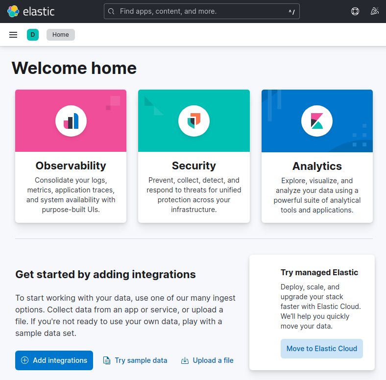
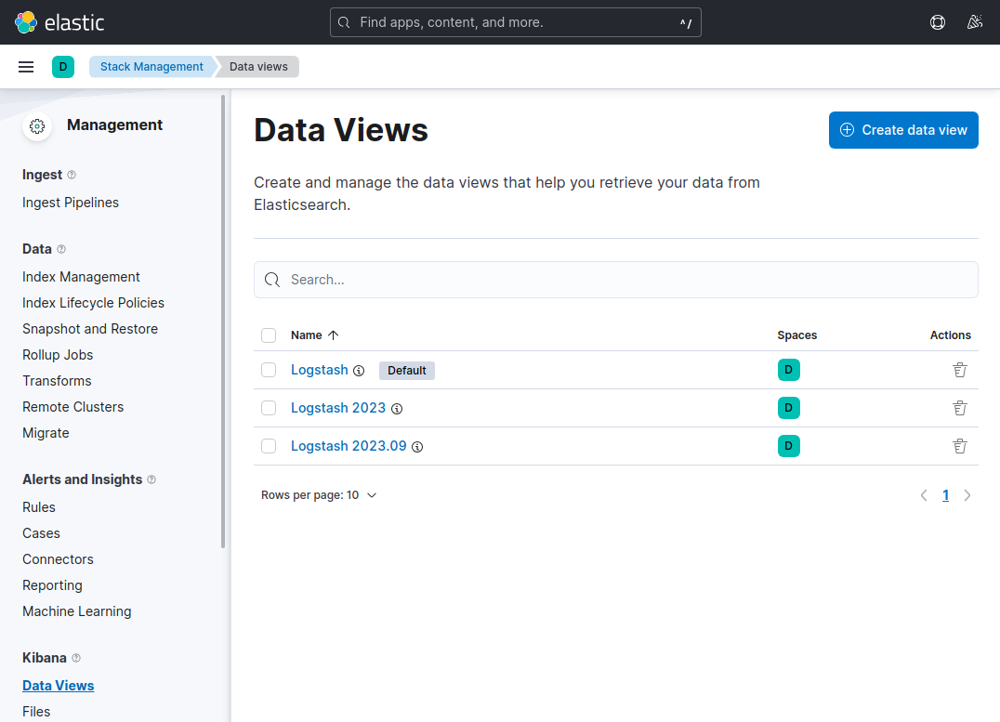
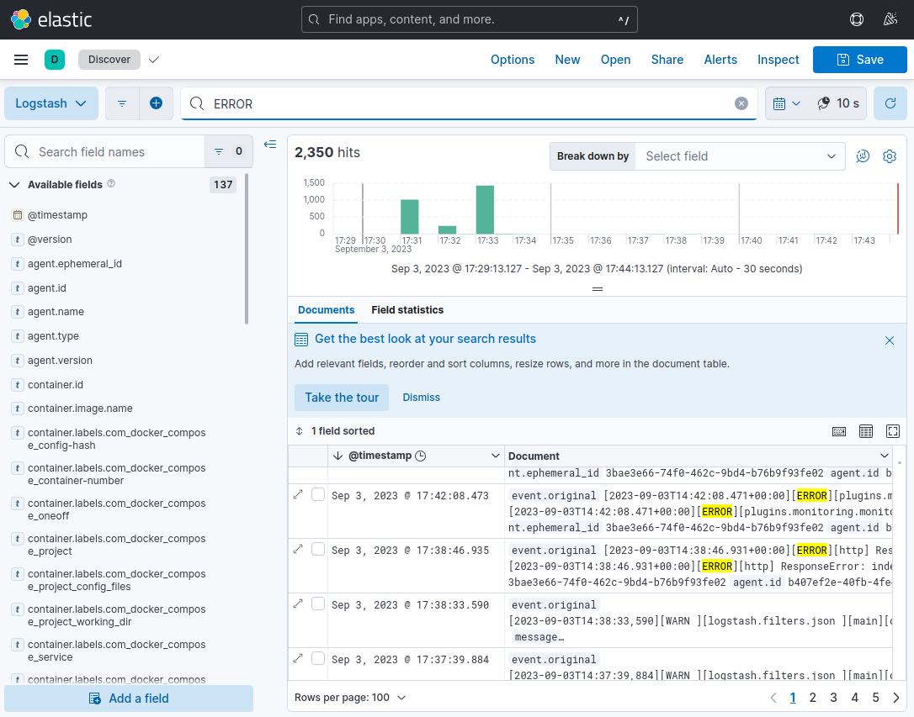
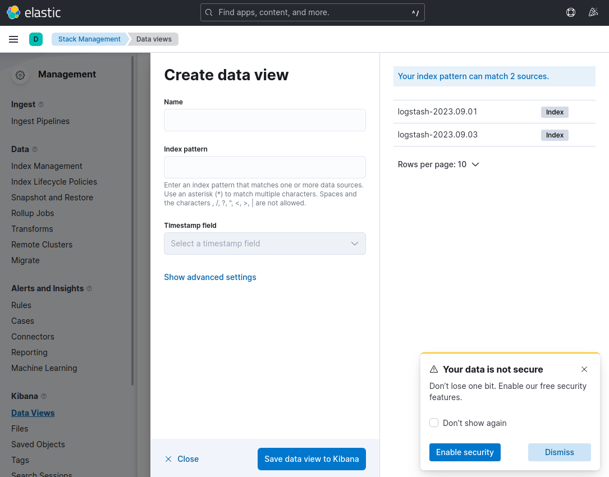

# Ответы на вопросы по домашнему заданию к занятию 15 «Система сбора логов Elastic Stack»

## Задание 1

**В директории [help](./help) находится манифест docker-compose и конфигурации filebeat/logstash для быстрого 
выполнения этого задания.**

**Результатом выполнения задания должны быть:**

- **скриншот `docker ps` через 5 минут после старта всех контейнеров (их должно быть 5);**
- **скриншот интерфейса kibana;**
- **docker-compose манифест (если вы не использовали директорию help);**
- **ваши yml-конфигурации для стека (если вы не использовали директорию help).**

Ответ:
```
fedor@fedor-Z68P-DS3:~/CODE/Netology/DevOps/mnt-homeworks/10-monitoring-04-elk/help$ docker ps
CONTAINER ID   IMAGE                    COMMAND                  CREATED       STATUS         PORTS                                                                                            NAMES
bec085e1c777   elastic/filebeat:8.7.0   "/usr/bin/tini -- /u…"   3 hours ago   Up 5 minutes                                                                                                    filebeat
5695f3180d04   kibana:8.7.0             "/bin/tini -- /usr/l…"   3 hours ago   Up 5 minutes   0.0.0.0:5601->5601/tcp, :::5601->5601/tcp                                                        kibana
6a1a86d8bb84   logstash:8.7.0           "/usr/local/bin/dock…"   3 hours ago   Up 5 minutes   0.0.0.0:5044->5044/tcp, :::5044->5044/tcp, 0.0.0.0:5046->5046/tcp, :::5046->5046/tcp, 9600/tcp   logstash
abbd0977b3ed   elasticsearch:8.7.0      "/bin/tini -- /usr/l…"   3 hours ago   Up 5 minutes   0.0.0.0:9200->9200/tcp, :::9200->9200/tcp, 9300/tcp                                              es-hot
78b30b91c290   python:3.9-alpine        "python3 /opt/run.py"    3 hours ago   Up 5 minutes                                                                                                    some_app
de6581887f5b   elasticsearch:8.7.0      "/bin/tini -- /usr/l…"   3 hours ago   Up 5 minutes   9200/tcp, 9300/tcp                                                                               es-warm
fedor@fedor-Z68P-DS3:~/CODE/Netology/DevOps/mnt-homeworks/10-monitoring-04-elk/help$
```



## Задание 2

Перейдите в меню [создания index-patterns  в kibana](http://localhost:5601/app/management/kibana/indexPatterns/create) и создайте несколько index-patterns из имеющихся.



Перейдите в меню просмотра логов в kibana (Discover) и самостоятельно изучите, как отображаются логи и как производить поиск по логам.



В манифесте директории help также приведенно dummy-приложение, которое генерирует рандомные события в stdout-контейнера.
Эти логи должны порождать индекс logstash-* в elasticsearch. Если этого индекса нет — воспользуйтесь советами и источниками из раздела «Дополнительные ссылки» этого задания.


 
